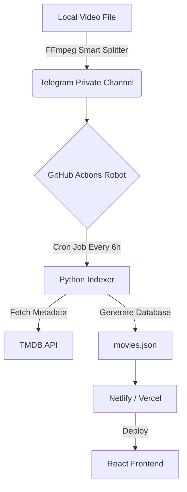

# Serverless Media Asset Management System


A fully automated, zero-cost media streaming architecture that leverages Telegram as an infinite cloud storage backend. This project creates a Netflix-like experience by autonomously indexing raw files, normalizing metadata via heuristic algorithms, fetching rich assets from TMDB, and deploying a static React frontend.

---

## 🏗 System Architecture

The system operates on a "Zero-Touch" pipeline. Once a file is uploaded to the secure storage channel, the entire process—from indexing to deployment—is automated via CI/CD.



---

## 🚀 Key Features

### 1. Zero-Cost Infrastructure

- **Storage:** Utilizes Telegram's unlimited cloud storage for documents/files
- **Compute:** Runs indexing scripts on GitHub Actions (Free Tier)
- **Hosting:** Deploys the frontend via Netlify/Vercel (Free Tier)

### 2. Intelligent "Anchor" Indexing

- **Problem:** Raw filenames are messy (e.g., `Movie.Name.2024.1080p.Multi.Audio.DD+.mkv`)
- **Solution:** Developed a custom normalization algorithm using Regex
- **Strategy:** Identifies the "Year Anchor" (e.g., 2024)
- **Logic:** Extracts the title before the anchor and discards technical metadata after it
- **Result:** Achieves near 100% match rate with the TMDB API

### 3. Automated Large File Handling

Telegram has a 2GB file limit. The solution:

- Engineered a local Python/FFmpeg script (`splitter.py`) that:
  - Analyzes video bitrate
  - Mathematically calculates safe split points to target 1.5GB chunks
  - Splits files without re-encoding (Stream Copy) to preserve 100% quality

- **Frontend Logic:** The Indexer automatically detects "Part 1 / Part 2" files and groups them into a single Virtual Series Folder on the UI

### 4. Self-Healing CI/CD Pipeline

- The system runs on a Cron Job (every 6 hours)
- If the Indexer crashes (e.g., API limits), the GitHub Action logs the error and retries in the next cycle
- **Authentication:** Implemented "Dialog Sync" to cache Peer IDs, preventing `PeerIdInvalid` errors common in stateless environments

---

## 🛠 Tech Stack

- **Frontend:** React, Vite, Tailwind CSS, Lucide Icons
- **Backend / Scripting:** Python 3.10
- **Libraries:**
  - `Pyrogram` (Telegram MTProto Client)
  - `Requests` (TMDB API Integration)
  - `FFmpeg` (Video Processing)
- **DevOps:** GitHub Actions (YAML Workflows), Git

---

## 📂 Project Structure

```bash
├── .github/workflows/   # CI/CD Automation scripts
├── client/              # React Frontend application
├── indexer.py           # The "Brain": Scans Telegram & builds JSON DB
├── splitter.py          # Local tool for splitting 4K files
├── movies.json          # Generated database (Single Source of Truth)
└── README.md            # Documentation
```

---

## 🔧 Setup & Installation

This project is designed to be self-hosted.

### Prerequisites

1. Telegram API Keys: Get `API_ID` and `API_HASH` from [my.telegram.org](https://my.telegram.org)
2. TMDB API Key: Register for a free developer key at [themoviedb.org](https://themoviedb.org)
3. GitHub Account: To host the repo and run Actions

### Deployment Steps

1. Clone the Repo:
   
   ```bash
   git clone https://github.com/your-username/your-repo.git
   ```

2. Set Secrets in GitHub:
   
   Go to `Settings > Secrets and variables > Actions` and add:
   - `TELEGRAM_API_ID`
   - `TELEGRAM_API_HASH`
   - `TELEGRAM_SESSION_STRING` (Generated via Pyrogram)
   - `TMDB_API_KEY`

3. Run the Indexer Locally (Optional):
   
   ```bash
   pip install -r requirements.txt
   python indexer.py
   ```

4. Push to Main:
   
   The GitHub Action defined in `.github/workflows/update.yml` will automatically trigger, scan your channel, and build the site.

---

## ⚠️ Disclaimer

This project is a Proof of Concept (PoC) designed to demonstrate system architecture, automation, and API integration skills. It is intended for personal data management and educational purposes only. The developer is not responsible for any misuse of this software.

---

*Built with ❤️ by Zeeshan Khan*